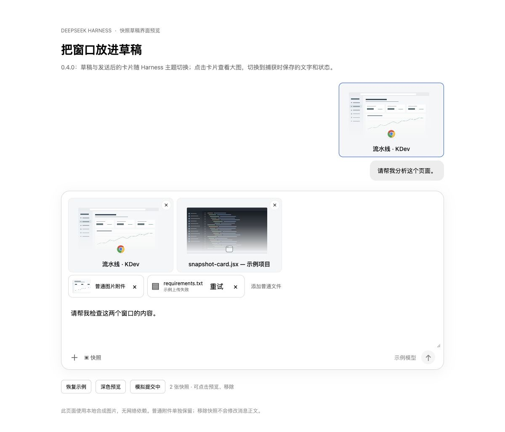

# DeepSeek Harness 窗口快照插件

面向官方 [deepseek-ai/deepseek-harness](https://github.com/deepseek-ai/deepseek-harness) 的独立插件，版本 `0.4.0`。在其它应用中同时按下左右修饰键，将前台窗口加入 Harness 当前会话的草稿。草稿、发送中和历史消息显示可点击的快照卡片，队列沿用静态缩略图；输入框与消息正文保留用户自己的文字，完整配对的快照在这些界面隐藏插件生成的文字块。模型同时收到截图、窗口元数据和可访问文字。卡片与文本预览随 Harness 主题变化；点击卡片可查看大图、缩放、下载，并切换查看捕获时保存的控件层级、文字和可获取状态。

| 系统 | 快捷键 | 原生程序 |
| --- | --- | --- |
| macOS 13+，Apple Silicon / Intel | 左 Command + 右 Command | universal Swift `.app` |
| Windows 10/11 x64 | 左 Ctrl + 右 Ctrl | 自包含 .NET 8 x64 `.exe` |
| Windows 10/11 ARM64 | 左 Ctrl + 右 Ctrl | 自包含 .NET 8 ARM64 `.exe` |

两键需同时处于按下状态；按住不会重复触发，松开任一键后可以再次触发。仅截前台应用的可见窗口，不回退到整屏截图。



## 安装

从 [v0.4.0 发布页面](https://github.com/kaelanvoss/dsh-context-snapshot/releases/tag/v0.4.0) 下载适合系统的安装包：

- [macOS Apple Silicon / Intel](https://github.com/kaelanvoss/dsh-context-snapshot/releases/download/v0.4.0/dsh-context-snapshot-0.4.0-macos.tgz)
- [Windows x64](https://github.com/kaelanvoss/dsh-context-snapshot/releases/download/v0.4.0/dsh-context-snapshot-0.4.0-windows-x64.tgz)
- [Windows ARM64](https://github.com/kaelanvoss/dsh-context-snapshot/releases/download/v0.4.0/dsh-context-snapshot-0.4.0-windows-arm64.tgz)

**直接安装请选择平台 `.tgz`，不用解压。** [源码压缩包](https://github.com/kaelanvoss/dsh-context-snapshot/releases/download/v0.4.0/dsh-context-snapshot-0.4.0-source.tar.gz) 及 GitHub 自动生成的 Source code ZIP / tar.gz 需要按下方步骤构建，不能作为预编译插件直接添加。[SHA256SUMS.txt](https://github.com/kaelanvoss/dsh-context-snapshot/releases/download/v0.4.0/SHA256SUMS.txt) 用于核对三个安装包及源码压缩包的完整性。平台安装包在 GitHub Actions 中从对应 tag 的源码构建并自检后发布。

公开接口已对官方 npm `0.2.0-rc.2` 与源码 `0.2.1-alpha.1` 核验。manifest 的可选 DSH peer 只声明这两个版本，避免在未经核验的旧版本上直接加载。该插件尚未发布到 npm，不要执行 `add dsh-context-snapshot` 从 registry 下载同名包。

推荐通过 Desktop 的「插件 → 添加插件」填写对应 `.tgz` 的绝对路径，安装后启用；无需单独安装 CLI。已有旧版时，使用新版本 tarball 路径替换安装，然后确认插件列表显示 `0.4.0`，完全退出再打开 Harness，使新版展示逻辑与原生程序加载。tarball 安装会更新同名包，通常无需先卸载。

`0.3.1` 曾因 Host 保存 WebP 而拒绝识别快照；`0.3.2` 已修复。`0.4.0` 保持 PNG / JPEG / WebP / GIF 识别和严格的 UUID、图片名、尺寸配对，继续隐藏界面正文里的上下文块；新增预览不改变消息提交或历史存储格式。

也可使用 CLI：先启动一次 Harness Desktop 初始化 profile，再完全退出 Desktop。在终端运行，最后重新打开 Desktop：

```sh
dsh plugin --profile desktop add "/absolute/path/dsh-context-snapshot-0.4.0-macos.tgz"
```

Windows PowerShell 使用对应的文件路径：

```powershell
dsh plugin --profile desktop add "C:\Downloads\dsh-context-snapshot-0.4.0-windows-x64.tgz"
```

若 `dsh` 不在 PATH，macOS 官方 Desktop 自带 CLI：`"/Applications/DeepSeek Harness.app/Contents/Resources/runtime/cli/bin/dsh"`。平台包已经包含原生程序，日常使用无需安装 Swift / .NET SDK。源码包用于开发和自行构建。macOS 二进制尚未 Developer ID 签名或公证。

## 使用

1. 在 Harness 中打开一个会话。输入框工具栏出现“▣ 快照”。
2. 点击“快照”，确认会话和原生程序就绪。macOS 首次使用点击“检查 / 授予系统权限”，按系统提示授予屏幕录制；读取文字还需要辅助功能，监听快捷键需要输入监控或辅助功能。更改授权后可点击“重启原生程序”。
3. 切换到要引用的应用窗口，同时按下左右 Command / Ctrl。
4. 返回 Harness，查看快照卡：卡片按参考图的 `250:177` 比例显示大窗口缩略图，底部渐变叠加，实际应用图标和窗口标题居中排列。点击草稿或消息中的卡片打开大图；有可访问文字时，右上“查看文本”切换到纯文本，再次点击切回图片。图片支持缩放、适应窗口和拖动，下载始终保存对应图片；同组多张快照可用左右按钮切换。关闭按钮、Esc 或空白遮罩退出，关闭重开后回到图片模式。草稿移除按钮独立删除整张快照。补充需求后发送，输入框、发送中、排队和历史正文中仍隐藏 `window_snapshot` 块。

草稿与发送后的卡片共用 Harness 主题变量。切换浅色 / 深色主题时，卡片背景、底部渐变、标题、缺图占位、通用窗口图标与移除按钮同步换色；窗口截图保留原始像素，主题只改变卡片的显示样式。

已有文字、引用 chip 和附件会保留。快照不会自动发送。没有已打开的会话时，本版不会自动创建会话。捕获前台 Harness / helper 自身窗口会返回跳过错误。插件本版不会自动把 Harness 切到前台。

窗口文字来自 macOS Accessibility 或 Windows UI Automation，属于尽力获取；新版按层级记录控件角色、名称、描述、值，以及系统确实提供的启用、焦点、选中、展开、勾选、文本选择等状态。密码和隐藏/离屏的安全过滤继续保留。不支持的状态省略，不根据图片推断，也不暴露网页 DOM 或应用内部业务数据。文字上限为 JavaScript 长度的 16,000 UTF-16 单位、300 个节点，遍历约一秒；超限部分不收录，不切断 UTF-16 代理对，macOS 还保留完整字素。截图 PNG 上限 12 MiB。

文本预览读取这张快照当时保存的内容，不会重新采集窗口，也不是 OCR。没有保存可访问文本时不出现“查看文本”；缺少的状态省略，不影响已有文本预览。旧快照仍显示它们原来保存的平铺文字，升级不能补出当时未记录的状态。截图与文字是同次捕获请求的结果，但系统采集过程不保证原子同步。

应用图标由原生程序从当前应用的本地资源读取，规范为 `32×32` PNG，解码后最多 `8 KiB`，随快照元数据保存，不从网络下载。读取失败以及没有图标的旧历史快照显示通用窗口图标，不影响图片和窗口文字。图标不会替代窗口截图。

图片和文字经官方普通用户消息链路提交。当前配置的模型仍需支持图像输入才能理解图片；插件不会改变模型能力。纯文本模型可读随消息提交的窗口文字，但附件是否允许发送由 Harness / provider 判断。

## 草稿与会话行为

- 快照目标在原生 `trigger` 到达 Host 时固定为最近同步的主会话。异步结果不会自动改投新会话。
- 切换会话时使用 generation 防止迟到请求恢复旧会话租约；同会话多个 composer 共享一次投递，ACK 重试不会重复添加图片。
- Harness 接收新会话首次同步之前仍有很短的窗口会沿用最近同步的会话，所以应确认目标会话就绪再切到来源窗口。
- 待处理图片只留在 Host 内存：最多 4 张、60 秒，处理确认后删除；插件不把截图写到磁盘。发送后的图片与消息按 Harness 自身规则存储。
- 快照图片和上下文在未发送时均为浏览器运行时数据，刷新或退出前需发送；尚未投递的内存队列也会随 Host 退出丢失。用户自行输入的普通草稿文字仍由 Harness 保存。
- 移除快照卡会通过官方附件删除链路一起释放图片和对应的隐藏上下文，不影响其他附件或用户正文。此版没有快照移除的撤销功能。
- 发送失败时，快照上下文会保留，图片卡片随 Harness 的草稿恢复链路恢复；重试只附带一次上下文。会话切换不会改投其他会话；官方显式携带草稿到另一工作区时，快照归属随之迁移。
- 快照用于普通消息发送；与 `/` 指令混用时明确拒绝发送并保留草稿，避免只传图片而遗漏窗口文字。退出该指令后可正常发送。
- 新版与旧版快照消息在图片和上下文能完整配对时均显示可点击卡片，消息的复制按钮只复制用户正文。预览用纯文本展示保存的 AX/UIA 数据，不执行其中的 HTML 或 Markdown。历史图片通过 Harness 已授权的附件加载接口读取；某张图片无法加载时仍可查看其已有文字。格式未知、上下文不完整或图片缺失时保留原内容，避免误隐藏用户输入。普通图片和文件继续使用 Harness 原有预览与操作。
- 隐藏只作用于插件启用时的界面呈现。完整窗口上下文仍经普通消息链路提交并保存在 Harness 会话记录中，导出或停用插件后可能看到原始 `window_snapshot` 块；此版不修改历史存储格式。排队快照保留图片消息的编辑限制，避免编辑正文时丢失上下文。
- 自动唤回、目标会话选择、移除撤销和草稿重启恢复尚未对齐 Codex。新版结构化文字受平台可访问性接口和读取预算限制，不能保证与 Codex 的完整 AX 输出相同。

## 接入方式

`conversation.input.attachments` 展示插槽呈现快照卡片，并继续使用原附件 renderer 处理普通图片、文件、上传重试与拖放。元数据按官方附件 ID 存储，不进入 Lexical 文档，也不复制 PNG base64。

通过 Cordis 公开的 `reflect.accessor` 对发布的 `ConversationController.sendSession` 做版本限定适配，在发送时按本次附件 ID 序列化窗口上下文；保留原始会话 receiver、queue / steer 模式和取消信号。删除、显式草稿迁移和指令附件序列化也在同一适配层处理。适配层随插件生命周期释放，不修改原型或输入框，不拦截 DOM 发送事件。该方法并非 Harness 专门提供的快照中间件，因此继续限制到已核验的 DSH 版本。

历史消息通过 `conversation.chat.node` 的 `user / steering` 组件呈现卡片；发送中和队列通过现有 ChatView / QueueDock 的 `useSession / useProjection` 展示快照投影处理。适配器可逆装饰原 slot entry 的 component，保留 entry 身份、store、注入、locale 与子插槽权限，卸载时恢复原组件；不向重复声明的子插槽注册替代入口，也不修改会话对象或 DOM。此能力依赖支持版本的具体实现，不能视为官方稳定的快照消息 API。

每张新快照使用独立 UUID，持久元数据与图片名共同标识它；同秒多张快照不会混淆。旧版的时间戳图片名也受支持。Host 可能将 PNG 归一化为其他官方图片类型并保留原文件名，展示识别允许 `image/png`、`image/jpeg`、`image/webp`、`image/gif`，仍需完整匹配元数据、图片名和有效尺寸；不会修改模型提交或会话存储中的原始内容。

## 开发与验证

源码可用 GitHub 的「Code → Download ZIP」、Release 的源码压缩包下载，也可克隆：

```sh
git clone https://github.com/kaelanvoss/dsh-context-snapshot.git
cd dsh-context-snapshot
```

需要 Node.js 22+（CI 使用 24）。macOS 原生构建还需要包含 Swift 6 的 Xcode Command Line Tools；Windows 原生构建需要 .NET 8 SDK。项目使用公开 npm registry，不依赖私有镜像。

```sh
npm ci --ignore-scripts
npm run build
npm test
```

`npm test` 会从公开 npm 下载固定 `0.2.0-rc.2` 的输入框、ChatView、slots、renderer 与 Connection 合同，校验 registry integrity，再运行全部回归；`npm run test:contracts` 可只运行发送合同测试。fixture 仅存 `.fixtures/`，不进入 Git 仓库或分发包。

macOS 构建：

```sh
npm run build:macos
npm run pack:macos
```

Windows PowerShell 构建：

```powershell
npm run build:windows
npm run pack:windows-x64
powershell -NoProfile -ExecutionPolicy Bypass -File scripts/build-windows.ps1 -Runtime win-arm64
npm run pack:windows-arm64
```

构建脚本会运行无截图的原生自测。生成的可安装 `.tgz` 位于 `artifacts/`，可直接把它的绝对路径填入 Harness。打包时也可以指定输出目录，例如 `npm run pack:macos -- /absolute/output/directory`。

`0.4.0` 已重新构建原生 helper：macOS universal 包含 arm64 / x86_64，当前 arm64 的 15 类无截图自检通过，包含结构树、状态、安全过滤与 UTF-16/emoji 边界；Windows x64 / ARM64 均为 0 warnings / 0 errors，各通过 45 项可移植检查。Windows 原生 22 项自测依赖 GDI，当前 macOS 无法执行；真实 UI Automation 采集仍待 Windows 验收。以下记录来自本地验证，推送后的远程 CI 状态以 GitHub Actions 为准。

`0.3.1` 的 JavaScript 全量 65 项和 IAB 合成界面检查虽通过，但未覆盖 Host 持久化图片压缩，实机发送后的 XML 隐藏失败。新增回归已在修复前用官方用户消息组件复现该失败。`0.3.2` 全量 68 项通过；只读回放用户指定的实际 WebP 快照消息也能正确识别，展示正文为空，原始图片、来源和模型内容不变。历史 `0.3.0` 的 59 项记录继续保留。

`0.4.0` 全量 77 项 JavaScript 回归与编译后 Client 在官方 ModuleLoader / Cordis / SlotRegistry 的加载、卸载通过。新增预览回归覆盖官方历史 WebP、pending/steering、授权图片加载及竞争、纯文本隔离、多卡导航、关闭重开、失败保留文本和草稿删除独立性。IAB 合成界面通过图片/文本切换、缩放/拖动、Ctrl+滚轮、焦点循环、Esc、浅色/深色文字对比度检查；截图内容与用户正文不变。下载链接和实际 MIME 文件名通过回归，但 IAB 未返回下载完成事件，真实 Desktop 文件保存仍需验收。合成检查不代替真实 Desktop 新版安装与捕获验收。

平台包装入对应架构二进制。Git 仓库只保存源码、构建脚本与文档，不提交 `node_modules`、fixture 或编译产物。源码采用 MIT 许可；Windows 分发包包含实际 .NET Runtime 对应的许可证和第三方声明。代码为独立实现，没有复制社区插件源码。

推送分支和 PR 会执行构建与回归检查。维护者推送与 `package.json` 版本一致的 `v*` tag 后，Release 工作流等待检查成功，再发布三个平台安装包、源码压缩包和校验文件。安装包尚未完成 Developer ID 公证 / Windows 代码签名；Windows 仍需实机截图验收。

详见 [验证记录](VALIDATION.md)、[macOS helper 说明](native/macos/README.md)、[Windows helper 说明](native/windows/README.md)。
