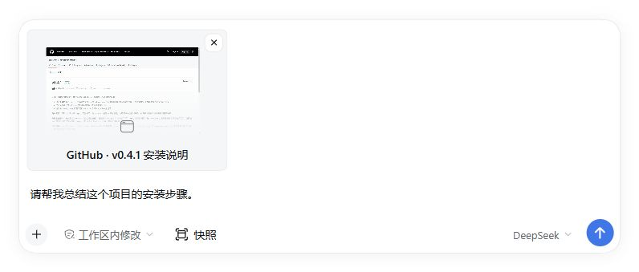

# DeepSeek Harness 窗口快照插件

面向 [DeepSeek Harness](https://github.com/deepseek-ai/deepseek-harness) 的独立插件：用快捷键把其它应用的前台窗口截图和可访问文本加入当前会话的草稿。你可以先预览、补充问题，再手动发送给模型。

支持图片缩放、拖动、下载和文本预览，界面跟随 Harness 的浅色 / 深色主题。



示例渲染采用 Harness 官方输入区样式和插件实际组件，窗口内容为公开发布页的真实截图。

## 安装

插件版本：`0.4.3`。支持 Harness `0.2.0-rc.2` 和 `0.2.1-alpha.1`；其它版本尚未核验。

| 系统 | 捕获快捷键 | 安装包 |
| --- | --- | --- |
| macOS 13+，Apple Silicon / Intel | 左 Command + 右 Command | [macOS](https://github.com/kaelanvoss/dsh-context-snapshot/releases/latest/download/dsh-context-snapshot-0.4.3-macos.tgz) |
| Windows 10/11 x64 | 左 Ctrl + 右 Ctrl | [Windows x64](https://github.com/kaelanvoss/dsh-context-snapshot/releases/latest/download/dsh-context-snapshot-0.4.3-windows-x64.tgz) |
| Windows 10/11 ARM64 | 左 Ctrl + 右 Ctrl | [Windows ARM64](https://github.com/kaelanvoss/dsh-context-snapshot/releases/latest/download/dsh-context-snapshot-0.4.3-windows-arm64.tgz) |

1. 下载对应系统的 **`.tgz` 安装包**，解压后找到其中的 `package` 目录。
2. 打开 Harness Desktop 的「插件 → 添加插件」，填写这个目录的绝对路径，例如 `C:\Downloads\dsh-context-snapshot-0.4.3-windows-x64\package`。
3. 安装并启用插件，打开会话，点击「快照」确认已就绪。若按钮未出现，完全退出再打开 Harness。

**升级已有版本**：先禁用插件，等待采集程序退出，卸载旧版，再通过「添加插件」安装新版。这与 Harness 当前的升级提示一致。Windows 从 `0.4.2` 或更早版本首次升级时，旧采集程序仍可能锁住安装目录；禁用后若无法卸载或仍报 `EPERM`，完全退出 Harness（包括托盘），按下方恢复步骤处理。

**安装来源怎么选？** 插件尚未发布到 npm，暂不能填包名安装；GitHub 仓库地址和 Source code ZIP / tar.gz 提供的是源码，缺少预编译程序。请用平台包解压得到的本地目录。底层安装器也能识别 `.tgz` 的绝对路径，可通过 CLI 直接安装，无需解压。

[最新版 Release](https://github.com/kaelanvoss/dsh-context-snapshot/releases/latest) · [安装包 SHA256 校验值](https://github.com/kaelanvoss/dsh-context-snapshot/releases/latest/download/SHA256SUMS.txt)

平台包已包含原生程序，使用时无需 Swift、.NET SDK 或额外运行时。`0.4.3` 起，Windows 采集程序从 `%LOCALAPPDATA%\dsh-context-snapshot\helpers\` 下按版本和内容区分的缓存目录运行，不再占用插件安装目录。此改动不修复旧版失败安装留下的残缺文件，也不提供自动更新或安装回滚。

预览工具栏会避开桌面标题栏的窗口按钮，并随全屏状态调整位置。

<details>
<summary>CLI 首次安装 / 异常恢复（可选）</summary>

先启动一次 Harness Desktop 初始化配置，再完全退出应用，包括托盘进程。将命令中的路径替换为实际安装包路径；不要在 Harness 或旧采集程序仍运行时覆盖安装。

macOS：

```sh
dsh plugin --profile desktop add "/absolute/path/dsh-context-snapshot-0.4.3-macos.tgz"
```

Windows PowerShell：

```powershell
dsh plugin --profile desktop add "C:\Downloads\dsh-context-snapshot-0.4.3-windows-x64.tgz"
```

macOS 若找不到 `dsh`，可使用 Desktop 自带的 CLI：`/Applications/DeepSeek Harness.app/Contents/Resources/runtime/cli/bin/dsh`。

Windows 自带 CLI 位于 `<Harness 安装目录>\resources\runtime\cli\bin\dsh.cmd`。若 `dsh` 不在 PATH，在 PowerShell 中用 `& "完整的 dsh.cmd 路径"` 替换命令里的 `dsh`。

若旧版安装已损坏、显示「异常」，或应用内无法卸载：确认 Harness 和 `ContextSnapshot.exe` 都已退出，先移除旧包，再运行上面的 `add` 命令，成功后重新打开 Harness：

```sh
dsh plugin --profile desktop remove dsh-context-snapshot
```

</details>

## 使用

1. 在 Harness 中打开目标会话，点击输入框工具栏的「快照」，确认显示「已就绪」。
2. macOS 首次使用时点击「检查权限」：截图需要屏幕录制权限，读取文字需要辅助功能权限，监听快捷键需要输入监控或辅助功能权限。更改权限后点击「重启采集」。
3. 切换到要引用的应用窗口，同时按下左右 Command（macOS）或左右 Ctrl（Windows）。两键都按下才会触发；松开任一键后可再次捕获。
4. 返回 Harness，检查草稿中的快照卡片，补充问题后发送。插件不会自动发送或把 Harness 切到前台。

| 操作 | 效果 |
| --- | --- |
| 点击草稿、发送中或历史消息里的快照卡片 | 打开大图，可缩放、适应窗口、拖动和下载 |
| 点击「查看文本」 | 显示捕获时保存的文字、控件层级及可获取的状态；再次点击切回图片 |
| 点击左右箭头 | 切换同组快照 |
| 点击关闭按钮、空白遮罩，或按 Esc | 关闭预览 |
| 点击草稿卡片的移除按钮 | 一起移除图片及其窗口上下文，保留其他附件和正文；暂不支持撤销 |

排队中的快照沿用静态缩略图。文本预览读取已保存的内容，不重新采集窗口，也不运行 OCR。

## 注意事项

- **捕获范围**：只截前台应用的可见窗口，不回退到整屏截图；Harness 和采集程序自身的窗口会跳过。先确认目标会话就绪，再切换到来源窗口捕获。
- **文本范围**：来自 macOS Accessibility / Windows UI Automation，内容取决于应用提供的信息。最多读取 300 个节点、16,000 个 UTF-16 单位，过滤可访问文本中的密码及隐藏 / 离屏内容；截图和文字不保证完全同步。
- **草稿保存**：未发送的快照在刷新或退出后丢失，Harness 保存的普通草稿文字不受影响。发送失败会恢复快照，重试不会重复附带上下文。
- **消息内容**：模型收到截图、窗口来源和可访问文本。插件启用时，输入框和消息正文隐藏插件生成的上下文，消息复制只包含用户正文；导出、原始记录或停用插件后可能看到 `window_snapshot` 文本块。发送后的图片与消息按 Harness 自身规则存储。
- **模型与指令**：理解图片需要支持图像输入的模型。快照与 `/` 指令混用时会拒绝发送并保留草稿，退出指令后可正常发送。

## 常见问题

| 问题 | 检查方法 |
| --- | --- |
| 没有「快照」按钮 | 检查 Harness 版本、插件是否启用，以及安装后是否完全重启 |
| 升级时报 `EPERM` 或安装后显示「异常」 | 旧版采集程序可能仍在占用文件；完全退出 Harness（包括托盘），确认 `ContextSnapshot.exe` 已结束，再用 CLI 先移除旧包、安装新版，见上方恢复步骤 |
| 快捷键没有反应 | 检查原生程序状态、macOS 权限、左右两键是否同时按下；来源窗口不能是 Harness 自身 |
| 没有「查看文本」按钮 | 这次捕获没有可访问文本，仍可预览图片；升级不会补回旧快照中未保存的信息 |
| 历史图片加载失败 | 有已保存的文字时仍可查看文本；检查 Harness 的附件是否可用 |
| 正文出现 `window_snapshot` 块 | 确认插件已启用并重启；图片缺失或上下文无法完整配对时会保留原内容 |

## 开发

需要 Node.js 22+。构建原生程序时，macOS 还需要包含 Swift 6 的 Xcode Command Line Tools，Windows 需要 .NET 8 SDK。

```sh
git clone https://github.com/kaelanvoss/dsh-context-snapshot.git
cd dsh-context-snapshot
npm ci --ignore-scripts
npm run build
npm test
```

测试会下载并校验固定版本的官方 Harness 组件，缓存到忽略的 `.fixtures/` 目录。仅运行发送接口测试可用 `npm run test:contracts`。

macOS 构建与打包：

```sh
npm run build:macos
npm run pack:macos
```

Windows PowerShell 构建与打包：

```powershell
# x64
npm run build:windows
npm run pack:windows-x64

# ARM64
powershell -NoProfile -ExecutionPolicy Bypass -File scripts/build-windows.ps1 -Runtime win-arm64
npm run pack:windows-arm64
```

构建脚本会运行原生自测，可安装的 `.tgz` 输出到 `artifacts/`。打包命令可指定输出目录，例如 `npm run pack:windows-x64 -- C:\Downloads`。

本地构建与 93 项 JavaScript 回归通过，Windows 缓存运行及运行中重命名原始目录已实机验证。Release 工作流从发布 tag 重建三个平台安装包，核验附件后只保留最新版下载，历史源码 tag 保留。这些检查不能替代真实 Desktop 的卸载安装、捕获、权限与文件保存验收。完整记录见 [VALIDATION.md](VALIDATION.md)。

原生采集与权限细节见 [macOS 说明](native/macos/README.md) 和 [Windows 说明](native/windows/README.md)。插件的会话适配依赖已核验版本的具体实现，升级 Harness 时需要重新验证。

## 许可

源码采用 [MIT 许可](LICENSE)。Windows 安装包包含对应运行时的许可证和第三方声明；安装包尚未完成 macOS Developer ID 公证或 Windows 代码签名。
